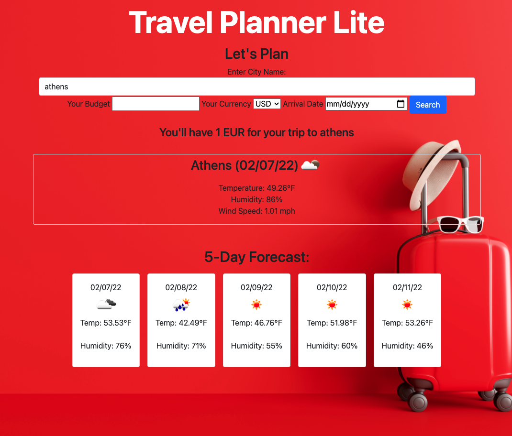

<h1>Travel Planner Lite</h1>
<h2>Purpose:</h2>
Travel Planner Lite is a website that allows you to plan your budget and weather appropriate packing choices by inputting how much money (in your local currency) you are bringing with you, the location you are traveling to, and your upcoming date of travel.
  
Built With: 
Html 
CSS 
JavaScript 

Website: URL

Repository: https://github.com/ishelly1997/Travel-Planner-Lite 

Screen Shot of Website 
